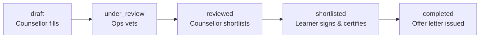

# Shortlisting — Product Requirements & Engineering Handoff

**Status:** draft for engineering review
**Scope:** rebuild on a real backend. The existing prototype is reference, not the target.
**Companion doc:** [`rule-sweep.md`](./rule-sweep.md) — every rule extracted from the
prototype with its enforcement site. This PRD is the readable form; the sweep is the
exhaustive one. Where they disagree, the sweep is more literal and this doc is more
current.

---

## 0. How to read this

A clickable prototype of this product exists and every rule below was extracted from it.
That makes this document unusually concrete — but it also means some rules are
*deliberate product decisions* and others are *incidental to a fast build*. They are
marked so you can tell them apart:

| Mark | Meaning |
|---|---|
| ✅ | Reviewed and confirmed as intended. Build this. |
| 🔄 | Reviewed and **changed**. Build the rule as stated here, not as the prototype does it. |
| ⬜ | Extracted from the prototype but **not yet reviewed**. Treat as provisional — likely right, but do not treat as signed off. |
| ❓ | Open question. Do not build until answered — see §16. |

**The prototype is not the specification.** It runs SQLite in the browser with no server,
no authentication, no file storage and no integrations. Those are not simplifications to
port; they are the parts you are building. Where the prototype's behaviour is worth
copying, this doc says so explicitly.

**Where the prototype is genuinely authoritative:** the flow, the state machine, the
guard conditions, the copy, and the interaction design. It has been walked repeatedly and
the edge cases in it are real ones that were hit and fixed.

---

## 1. What this is

Four roles move one eligibility form through five states, ending in an offer letter.

An **Academic Counsellor** fills the form on a call with a prospective learner and
recommends programmes. **Ops** vets it field by field against uploaded documents and
rules each programme eligible or not. The counsellor **shortlists exactly one** and sends
it. The **learner** reviews, signs undertakings and certifies. Ops releases the **offer
letter**.

**The single most important thing to understand before building:** this pipeline is
**one-way**, and the one loop that exists — a learner editing their details after vetting
— is deliberately **not** a state transition. It is a flag that rides on top of whatever
state the application reached. §10 covers it, and it is where most of the complexity
lives.

---

## 2. Roles and access

| Role | What they own |
|---|---|
| **Learner** | Their own details and documents. Signs and certifies. |
| **Academic Counsellor (AC)** | The form during draft. Programme recommendations. The shortlist decision. Owns the relationship with the learner throughout. |
| **Ops** | Vetting: field verdicts, document verification, eligibility rulings, the offer letter. |
| **Admin** | Users and role assignment. No application access beyond aggregate counts. |

⬜ One application per learner. ❓ **Q5** asks whether that holds.
⬜ The AC is assigned when the application is created; the Ops owner on first open.
**Both are currently write-once.** ❓ **Q1** asks whether they should be reassignable.
❓ **Q2** asks how role access should work at all, given upGrad's existing systems — the
prototype's four-string model is almost certainly not what you want.

**Claiming.** ⬜ The first Ops user to *open* an unassigned application under vetting is
assigned it. Opening is claiming; there is no confirm step. Note this must not happen
during a render pass — see §15.4.

⬜ **Ops scoping is currently absent:** any Ops user can act on any application, including
one another Ops user has claimed. Ownership affects *notifications only*. Folded into Q1.

---

## 3. The state model

### 3.1 Statuses

Five, strictly ordered, never moving backwards.

| Status | Meaning | Who advances it |
|---|---|---|
| `draft` | AC is filling the form | AC → `under_review` |
| `under_review` | In Ops' vetting queue | Ops → `reviewed` |
| `reviewed` | Vetted; programmes ruled on | AC → `shortlisted` |
| `shortlisted` | One programme sent to the learner | Ops → `completed` |
| `completed` | Offer letter issued | terminal |

✅ No other transitions exist. No skipping, no rewinding, and no role may make a
transition that is not theirs.

⬜ **There is no rejection or withdrawal path.** An application cannot be abandoned,
declined or closed unsuccessfully. A learner who drops out stays wherever they were,
forever. This is a real gap for production — see §17.

### 3.2 Orthogonal flags

Three things are **not** statuses and must not be modelled as such:

| Flag | Meaning |
|---|---|
| `certified_at` | The learner has certified their details are correct. Withdrawn automatically by their own edit. |
| `recheck` (`at`, `state`, `kind`, `fields`, `changes`) | An open re-check. `state` is `ops` or `ac` — whose move it is. `kind` is `learner` or `appeal`. |
| `eligibility_stale` (per programme) | This verdict was made against answers that have since changed. |

### 3.3 Why re-check is a flag and not a sixth status

Because rewinding to `under_review` would strip the counsellor's shortlist and the
learner's signed undertakings of the state they were made in — and because a form that
can bounce between two editors bounces forever.

A re-check is a smaller thing than a re-vetting: *read what moved, comment on it if it's
wrong, clear it if it isn't.* The status stays where it was.

**If you take one design decision from this document, take this one.** Modelling the
re-check as a status is the most expensive mistake available here.

---

## 4. Cross-cutting invariants

These govern every screen. They are stated once here rather than repeated per stage.

**4.1 ✅ One editor at a time.** Exactly one role may write the learner's answers at any
moment: the AC in `draft`, Ops in `under_review`, nobody afterwards. The learner is
separate — they always own their own details, which is a different thing from vetting the
form.

**4.2 ✅ Ops comments; the counsellor corrects.** Ops never edits the counsellor's
answers. Anything wrong gets a comment pinned to the field. Ops fills only the eight
**ops-owned** fields, which are transcribed from documents (Appendix A). Every fill is
logged with before → after.

**4.3 ✅ The locker is not the form.** Document upload has its own permission window,
because files keep arriving after vetting ends. See §12.

**4.4 ✅ The learner is told what is happening, never whose desk it is on.** They see
three stages, not five statuses, and no activity log. Which internal team holds the file
is not their business, and naming it only invites "why is it still there?".

**4.5 ✅ Nothing is invented.** Programmes come from a master catalogue; undertakings from
a template library. Neither role can author one.

**4.6 ⬜ Everything is logged.** Every mutation writes a timeline event. The learner never
sees it.

**4.7 ✅ At `completed`, everything freezes.** No edits, no uploads, no verification, no
comment resolution, no appeals.

---

## 5. Stage 1 — Counsellor fills the form (`draft`)

The AC is on a call with the learner. They find them in their list, fill the eligibility
form, collect whatever documents the learner has to hand, and recommend programmes.

### 5.1 Behaviour

- ✅ **Autosave, and three explicit save controls.** *Save draft*, *Next* and *Submit for
  Vetting* all persist. Every save writes **all** fields, not just the visible step.
  Moving between steps via the step strip does not itself save; values persist in client
  state until the next save. No timeline event is written for a save.
- ⬜ **Lead sync.** Identity and intent only — name, mobile, degree level, countries,
  financing. Never academics. Fills **empty fields only**, never overwrites, and un-ticks
  any section it wrote into.
- ⬜ **Recommendations with a match score.** The AC picks from the catalogue, ranked by a
  deterministic score (Appendix D). Every lost point names its reason, because the AC
  quotes this to the learner and Ops second-guesses it later.

### 5.2 Operations

| Operation | Preconditions — **all** must hold, else refuse |
|---|---|
| `saveForm` | Caller is the assigned AC · status is `draft`, **or** a re-check has been handed to the AC |
| `addProgram` | Caller is the assigned AC · status is `draft` or re-check handed to AC · 🔄 **fewer than 3** programmes already · catalogue entry exists · not already attached |
| `removeProgram` | As above · the programme is **not** shortlisted |
| `submitForm` | Caller is the assigned AC · status is `draft` · **nothing missing** (below) |

### 5.3 🔄 The programme cap is 3

The prototype allows 5. **The rule is 3**: the counsellor may request eligibility for at
most three programmes. The cap counts *live options* and is **waived when nothing is
eligible** — that waiver is the documented escape hatch out of a dead-ended application
and must survive the change.

### 5.4 Submit gate

⬜ Submit is refused — in the UI *and* in the API, independently — unless all of these
exist: name, mobile, gender, date of birth, guardian email (if under 18), degree level,
country, Class 10 marksheet, Class 12 board, Class 12 status, Bachelor's status (if
Masters), financing plan, and **at least one recommended programme**.

❓ **Q3 / Q6:** no *document* is required at submit today. Both what is required and
whether it blocks are open.

### 5.5 On submit

Undertakings are generated: every always-required template, plus one per clause the
answers triggered (Appendix C). Runs once. The guardian-consent document names the
**guardian** as declarant, not the learner. Ops is notified.

---

## 6. Stage 2 — Ops vetting (`under_review`)

Ops reads the form against the documents, corrects what is theirs to correct, comments on
what is not, verifies documents, and rules on each recommended programme.

### 6.1 Behaviour

- ✅ **Ops fills only ops-owned fields** (Appendix A). Everything else is comment-only.
- ⬜ **Comments are `action` or `info`.** An action comment must be dealt with before the
  shortlist goes out; an info comment is context.
- ⬜ **Field verdicts and section verdicts stay in sync both ways.** All fields correct ⇒
  section verified. Any field incorrect ⇒ section verification cleared. Ruling a section
  stamps every field beneath it. Clicking a verdict it already has clears it.
- ⬜ **Only four sections are Ops' to rule on** — Profile, Class 10, Class 12, Bachelor's.
  "After graduation" and "Financing" are the counsellor's own confirmation.
  ❓ **Q4** — and note the prototype contradicts itself here: it lets Ops rule on
  *individual fields* inside the two sections it says are not theirs.
- ⬜ **A "not verified" section verdict with a comment** also raises an action comment
  pinned to the first field in that section that renders a comment slot. Flipping back to
  verified auto-resolves it.

### 6.2 Operations

| Operation | Preconditions |
|---|---|
| `updateFieldValue` (Ops) | Status `under_review` **or** re-check on Ops' desk · field is ops-owned · value within bounds · value actually changed |
| `addRemark` | ⬜ Caller is Ops · non-empty text. ❓ Q4/D3: must also refuse ops-owned fields — currently UI-only |
| `setFieldCheck` | Status `under_review` or re-check on Ops' desk · field is **not** ops-owned |
| `setGroupReview` | As above · the section is one of the four Ops rules on |
| `verifyLearnerDoc` | Caller is Ops · status not `completed` · the slot has a file · verdict is `verified` or `rejected` |
| `setProgramEligibility` | Status `under_review` **or** re-check on Ops' desk · the **shortlisted** programme may only be re-ruled during a re-check |
| `markReviewed` | Status `under_review` · **at least one eligible programme** · 🔄 **every required document verified** |

### 6.3 🔄 Marking reviewed requires verified documents

The prototype requires neither documents nor complete section rulings. **The rule is that
every required document must be verified first.** Open comments still do *not* block.

Still to pin down, in ❓ **Q3**: which document set, and whether it varies by degree level
(the required set includes UG degree and UG marksheet, which mean nothing for a Bachelors
applicant), and whether a *rejected* document blocks or only a missing one.

---

## 7. Stage 3 — Counsellor shortlists (`reviewed`)

Ops has finished and the counsellor is notified. They read the comments, fix what is
theirs to fix, and send the learner exactly one programme.

### 7.1 Operations

| Operation | Preconditions |
|---|---|
| `updateFieldValue` (AC) | Caller is the assigned AC · status `reviewed`, or any re-check open, or the shortlist has been withdrawn · field is **not** ops-owned · value changed and within bounds |
| `acknowledgeRemark` / `replyToRemark` | Caller is a participant. Neither closes the comment |
| `resolveRemark` | ⬜ **Ops only.** The AC answers; the person who raised the question decides it is answered |
| `shortlistProgram` | Caller is the assigned AC · **no re-check open** · status `reviewed`, or `shortlisted` with the shortlist withdrawn · the programme is ruled **eligible** |
| `appealEligibility` | Caller is the assigned AC · status `reviewed`, or `shortlisted` with the shortlist off · **no re-check open** · a note is mandatory · only a `not_eligible` verdict can be appealed |

### 7.2 ✅ Exactly one programme

Not a list for the learner to choose from. Shortlisting clears any previous selection
first, so re-running it can never leave two marked. Not-eligible programmes stay visible
and greyed, so the decision is explainable.

### 7.3 Appeals

The counsellor's answer to a verdict they think is wrong, in two shapes: **reconsider**
(send this verdict back to Ops with an argument) or **suggest** (propose a catalogue
programme instead). Both route back to Ops using the re-check machinery, tagged as an
appeal. See §11.

---

## 8. Stage 4 — Learner signs and certifies (`shortlisted`)

### 8.1 ✅ Visibility — the learner sees nothing until the first shortlist

Before the first shortlist lands, the learner has **no application at all**: no status, no
documents, no counsellor name. They see "we're preparing your options". The application
tab, the sub-navigation and direct links are all closed.

**Once shown, it stays shown** — through re-checks, through the counsellor swapping the
programme, through the shortlist being withdrawn — and always shows the latest state.
Implement as `stage(status) >= stage(shortlisted)` rather than a stored flag, so the
property holds by construction.

✅ Their own personal details remain readable in their profile throughout, including
before the application appears. That is their data, not the application.

### 8.2 The walk

Reading comes before signing: details → programme → undertaking, in that order, with no
way to reach a signature without having just re-read what it certifies.

⬜ **Every signature takes an OTP** sent to the learner's phone. *(Prototype: no SMS is
sent and any 4-digit code passes. Real delivery is yours to build.)*

### 8.3 Operations

| Operation | Preconditions |
|---|---|
| `signDocument` | Caller is the learner · status `shortlisted` · document unsigned · signature present · OTP verified |
| `certifyDetails` | Caller is the learner · not already certified · **no open re-check** (appeals excepted) · at least one document and **all signed** · **a programme is still shortlisted** |
| `updateLearnerDetails` | Caller is the learner · status is not `completed` · values within bounds · ops-owned fields ignored |

### 8.4 ✅ Details lock when the offer letter is released

The learner may edit at any point before `completed`. Releasing the offer letter is what
sets `completed`, so the lock lands exactly then — and freezes everything else with it
(§4.7).

### 8.5 ❓ Certification and the downstream sync

The prototype treats certifying as the moment the certified details are "auto-filled into
the shortlisted programme's application" — **but this is a log line only. Nothing is
synced, and no sync state exists.** The original journey diagram gated the offer letter on
the sync completing; the prototype dropped that gate.

**❓ Q7 — do not build Stage 4's ending until this is answered.** It needs a target
system, a field mapping, failure handling, and idempotency (repeat certification after a
re-check is normal, not an edge case).

---

## 9. Stage 5 — Offer letter (`completed`)

| Operation | Preconditions — **six**, all required |
|---|---|
| `sendOfferLetter` | Caller is Ops · status `shortlisted` · no letter already issued · at least one document · **every** document signed · `certified_at` set · **no open re-check** · a programme still shortlisted |

The learner is notified. The application freezes.

---

## 10. The re-check loop

**This spans every stage. Read it as one thing.**

A learner who edits their details after vetting has changed something that was vetted, and
what was vetted is no longer what is on file. That raises a **re-check**: a flag Ops must
clear, sitting on top of whatever status the application reached.

### 10.1 What an edit does

⬜ When the learner changes one or more answers and the application is past `draft`:

1. **Certification is withdrawn** — they certified values that no longer exist.
2. **A re-check opens** with `state = ops`, recording which fields moved and their
   before → after values.
3. **If the edit touched an eligibility input** (Appendix B), **every** programme verdict
   is marked stale — the shortlisted one included.
4. The counsellor is notified first (they own the relationship), then Ops (whose queue it
   lands in).

⬜ **A second edit extends the re-check; it never restarts it.** `recheck_at` is
preserved, the changed-field list is merged, and the original "from" values are kept so
the diff always reads against what Ops actually ruled on. Rebasing the timestamp would
strand comments Ops had already written.

### 10.2 The two exits

| Exit | Preconditions | Effect |
|---|---|---|
| **Clear it** | Re-check open · **not** handed to the AC · **no stale verdicts remain** · **at least one programme eligible** | Re-check closes. Newly-triggered undertakings attach; unsigned auto-generated ones that no longer apply are **detached** |
| **Send to the counsellor** | Re-check open · not already with the AC · at least one open **action** comment raised **on this change** | `state` becomes `ac`. The AC resolves it with the learner |

⬜ The AC hands it back only once every comment from this re-check is **answered** —
acknowledged or replied to, **not** resolved, since resolving is Ops' call. The learner's
next edit sends it straight back to Ops on its own.

### 10.3 The case this exists for

A learner edits their way out of the programme they were sent.

Ops re-rules the shortlisted programme `not_eligible` → **the shortlist is withdrawn**
(nobody signs an offer for a programme they don't qualify for) → the counsellor is told to
choose again from what is still eligible → the learner is told their programme is being
re-confirmed.

✅ During that window the learner still sees their application, and its status reads
**"Being confirmed"** — not "Action needed", because nothing is waiting on them.

⬜ **Detaching stale undertakings matters.** A learner who edits *out* of a declaration —
backlogs back to zero, a status no longer "Pursuing" — would otherwise be left with an
undertaking nobody can remove, and certification requires every document signed. It would
block them permanently.

---

## 11. Appeals

⬜ An appeal is the counsellor arguing with Ops about a programme. It reuses the re-check
machinery, tagged `appeal`, because it is the same question — *someone wants Ops to look
again*.

It differs from a learner re-check in three ways that must be preserved:

- The **learner is never told**. Nothing of theirs is in question.
- It does **not** withdraw certification.
- Ops ruling again on the programme **clears the appeal automatically**.

⬜ A learner edit landing on top of an open appeal leaves it tagged as an appeal.

---

## 12. Documents — the locker

⬜ A fixed **checklist**, not a pile of uploads: every learner carries the same slots, so
"still missing" is as legible as "here it is". 29 slots are defined; 10 are shown during
shortlisting (8 required, 2 conditional) — Appendix E.

### 12.1 ✅ Who may upload, and when

**One line decides it: can the counsellor change a document Ops is reading right now? No.
Anything else, yes.**

| Role | Window |
|---|---|
| **Learner** | Any time until `completed` |
| **Counsellor** | `draft`, `reviewed`, or a re-check handed to them → **full access**, including replacing a rejected scan · `under_review` or a re-check on Ops' desk → **empty slots only**: no replacing a file already in, rejected ones included, and no removing |
| **Ops** | Any time until `completed` |

✅ No form field is editable by the counsellor while Ops is reading. The locker is the only
thing that moves in that window.

### 12.2 Verification

- ⬜ **Ops alone verifies.** Nobody else marks a document good.
- ⬜ **Replacing a document returns it to pending.** Ops verified the file that was there,
  not whatever replaces it.
- ⬜ **A verified document can only be removed by Ops.**
- ⬜ **Rejection notifies:** the counsellor before the first shortlist, the learner after.
  Pre-shortlist the learner has no application to open, so the counsellor — who collected
  the documents and owns the relationship — is the one who chases.

### 12.3 ❓ There are no files

`filename` is a text column. Nothing is stored, nothing is validated, nothing is scanned.
Two structural problems for the rebuild, both in **Q9**:

- **One file per slot.** The "Passport (front & back)" slot can hold one image; a
  multi-page transcript cannot be uploaded at all.
- **Ops transcribes values off these scans**, so whatever formats are accepted must be
  **viewable in-browser without downloading**. That is a rendering pipeline, not a
  validation setting.

---

## 13. What the learner sees

⬜ **Three stages, not five statuses:** *In progress* → *Programmes ready* → *Offer
letter*.

| Their status reads | When |
|---|---|
| *(nothing — no application)* | Before the first shortlist |
| Action needed | Shortlisted, not yet certified, programme in place |
| Being checked | A re-check of **their own edit** is open |
| Being confirmed | The shortlist came off; a new programme is being settled |
| With upGrad | Certified, waiting on the offer letter |
| Completed | Offer letter issued |

⬜ No activity log. ⬜ Appeals are invisible to them entirely.

---

## 14. Notification matrix

⬜ In-app only today. Email/SMS is a rebuild decision.

| Trigger | Learner | Counsellor | Ops |
|---|---|---|---|
| Form submitted | — | — | ✔ new submission |
| Document rejected | ✔ *only after first shortlist* | ✔ *before first shortlist* | — |
| Comment reply | — | ✔ (if Ops replied) | ✔ (if AC replied) |
| Marked reviewed | — | ✔ programmes ready | — |
| Ops adds an eligible programme | — | ✔ ready to shortlist | — |
| Shortlisted programme ruled out | — | ✔ choose again | — |
| Shortlist sent | ✔ congratulations / programme updated | — | — |
| All documents signed | — | ✔ still to certify | ✔ still to certify |
| Learner certifies | — | ✔ | ✔ offer letter can go out |
| Learner edits after vetting | — | ✔ first — they own the relationship | ✔ re-check needed |
| Re-check cleared | ✔ outcome, never whose desk | ✔ | — |
| Re-check sent to counsellor | ✔ "your counsellor will get in touch" | ✔ comments to resolve | — |
| Appeal raised / answered | ✖ **never** | ✔ | ✔ |
| Offer letter released | ✔ | ✔ | — |

**Rule behind the table:** the learner is told *what is happening*, never *who is holding
it*. Ops-directed notifications go to the assigned Ops user if there is one, otherwise to
the whole Ops role — ❓ **Q1**, since that means a claimed application stops notifying
anyone else.

---

## 15. Building it

### 15.1 Entities

`users` · `applications` · `form_responses` · `learner_documents` · `documents`
(undertakings) · `document_templates` · `programs` · `program_catalogue` · `remarks` ·
`remark_replies` · `field_checks` · `group_checks` · `events` · `notifications` ·
`offer_letters`

The prototype's schema is a reasonable starting shape and the column comments explain most
of the *why*. Four decisions it got wrong or dodged, which the rebuild must settle:

| Issue | Question |
|---|---|
| `form_responses` and `learner_documents` are keyed by **application**, so personal details and the entire document locker duplicate if a learner ever applies twice | **Q5** |
| One file per document slot | **Q9** |
| No sync state for the downstream integration | **Q7** |
| `users.role` is a single string; no permissions, scopes, teams or hierarchy | **Q2** |

### 15.2 API surface

Every operation in §5–§9 is a mutation with an explicit precondition list. **Enforce all
of them server-side.** Several rules in the prototype are UI-only (the disabled button is
the whole enforcement) and those become holes the moment an API exists — D3 in the sweep
is one, and there are likely others. Treat "the control isn't rendered" as *not
implemented*.

Where the prototype gates in both places — the submit button is disabled *and*
`submitForm` independently refuses — copy that pattern.

### 15.3 Non-functional

- **Auth:** none exists. See **Q2**.
- **Files:** none exist. See **Q9**, including compliance — these are Aadhaar and passport
  scans and the locker falls under DPDP.
- **Audit:** a timeline event per mutation exists and is good. Role changes are **not**
  logged; they should be.
- **SLA / ageing:** nothing escalates, nothing is chased, nothing goes red with time. See
  §17.

### 15.4 Two implementation notes worth inheriting

**Never mutate state during a render pass.** Opening an application records the visit and,
for Ops, claims it. In the prototype this had to be moved into an explicit client effect,
because framework re-renders (prefetches, revalidation) silently started vetting on
applications nobody had opened.

**One component per concern, reused across roles.** The document table, upload tiles,
remark cards and undertaking cards render identically everywhere on purpose. This codebase
was bitten repeatedly by two implementations of the same thing drifting apart.

---

## 16. Open questions

**Nothing in this section should be built until it is answered.** Each carries its owner
and what the prototype currently does. Full detail, including the sub-questions and the
consequences, is in [`rule-sweep.md`](./rule-sweep.md) under the same numbers.

| # | Question | Owner | Blocking? |
|---|---|---|---|
| **Q1** | Can the assigned Ops owner change mid-process? And the counsellor? Both are write-once today, and a claimed application stops notifying anyone else — so an owner on leave makes it invisible. | Business | Before launch |
| **Q2** | How does role access work in the existing products? The prototype invented four hardcoded role strings with no permissions, scopes or teams, and assigns roles inside this product. Almost certainly should consume an existing identity/RBAC system. | Engineering | **Yes — blocks §15.1** |
| **Q3** | Which documents must exist before the form goes to Ops? Does the required set vary by degree level? Does a *rejected* document count as missing? | Business | **Yes — blocks 🔄 D12** |
| **Q4** | Which answers actually need a per-field Ops verdict? All ~26 are rulable today, which contradicts the rule that two sections are not Ops' to review. Also determines whether the section-verdict rollup survives. | Business | Before Stage 2 |
| **Q5** | Can a learner ever have more than one application? Personal details and the whole document locker are keyed per application, so a second one duplicates everything. | Business | **Yes — schema** |
| **Q6** | Should a missing document *block* submission, or warn? The hard-stop machinery already exists and is proven; this is policy, not feasibility. | Business | With Q3 |
| **Q7** | The downstream sync — is auto-fill-on-certification buildable, and should the offer letter wait for it? Nothing is implemented; the original diagram's sync gate was dropped. | Engineering + Business | **Yes — blocks Stage 4's ending** |
| **Q9** | File storage and supported formats. Nothing is stored today. Includes multi-file slots, an in-browser rendering pipeline for Ops, virus scanning, retention, and DPDP/Aadhaar compliance. | Engineering + Business + Legal | **Yes — blocks §12** |

*(Q8 — who can add a document once vetting has started — is **decided and implemented**;
it is §12.1.)*

**The sweep is not finished.** Roughly 70 of the ~82 extracted rules are still marked ⬜ —
provisional, not signed off. Completing that pass will produce more questions and more
changes.

---

## 17. Not built, and worth deciding

| Gap | Note |
|---|---|
| **No rejection or withdrawal path** | An application only goes forwards. No terminal state for "learner dropped out" or "eligible for nothing". Probably the largest functional hole. |
| **The downstream application sync** | Q7. |
| **"Welcome 2.0"** — the extended form | Below the line on the original journey diagram, awaiting the business team. |
| **No SLA or ageing** | Nothing escalates or is chased. |
| **No bulk actions for Ops** | Every application is worked one at a time. |
| **No reassignment** | Q1. |
| **No real auth, no file storage, no email/SMS** | Q2, Q9. |

---

## Appendix A — Ops-owned fields

Transcribed from documents by Ops; never editable by the counsellor or the learner, and
never subject to an Ops field verdict (there is nobody to rule against).

`score_10` · `completion_10` · `school_name` · `score_12` · `bachelor_score` ·
`bachelor_university` · `bachelor_mode` · `career_gap_months`

## Appendix B — Eligibility inputs

Changing any of these after vetting marks **every** programme verdict stale.

`dob` · `degree_level` · `countries` · `board_12` · `status_12` · `has_marksheet_12` ·
`mbbs_intent` · `neet_status` · `bachelor_status` · `bachelor_docs` · `backlogs` ·
`pg_status` · `pg_docs` · `work_exp_months` · `finance_plan`

Deliberately **not** included: ops-owned fields (the learner cannot touch them, and Ops
re-reading their own entry is not a re-check), and anything with no bearing on a verdict
— a phone number does not un-make an eligibility ruling.

## Appendix C — Clause triggers

| Clause | Triggered when |
|---|---|
| Parent / guardian consent | Learner is under 18 |
| Visa-age acknowledgement | Bachelors and over 30, or Masters and over 45 |
| Class 12 completion undertaking | Class 12 status is "Pursuing" |
| Class 12 marksheet to follow | Final marksheet "Not yet available" |
| Bachelor's / PG documents pending | Masters, and Bachelor's status starts "Pursuing"; or PG documents partial/absent |
| Bachelor's marksheets incomplete | Masters, and Bachelor's documents are partial or absent |
| Backlog / ATKT declaration | Masters, and backlogs > 0 |
| Financing undertaking | Any financing plan chosen |

Plus generic clauses appended by degree tag. Recomputed on **every** write path that
touches an answer — the counsellor's form, Ops' field fills, and the learner's own edits —
or a change that newly requires an undertaking would never produce one.

## Appendix D — Match score

Deterministic and explainable, because the counsellor quotes it to the learner and Ops
second-guesses it.

| Component | Weight |
|---|---|
| Country match | 40 |
| Degree level match | 25 |
| Academic score meets minimum | 20 |
| Work experience meets minimum | 15 |

Every lost point names its reason. Clamped to 2–99.

## Appendix E — Shortlisting document set

10 of the 29 defined slots are shown during shortlisting.

**Required (8):** 10th Marksheet · 12th Marksheet · UG Degree · UG Marksheet ·
IELTS/TOEFL/PTE/Duolingo Scorecard · Statement of Purpose · Passport (front & back) ·
Aadhaar Card

**Conditional (2), never chased as missing:** Work Experience Document · GRE/GMAT/SAT/ACT

❓ **Q3:** UG Degree and UG Marksheet are in the required set but mean nothing for a
Bachelors or Profile Building applicant. The required set probably varies by degree level.
